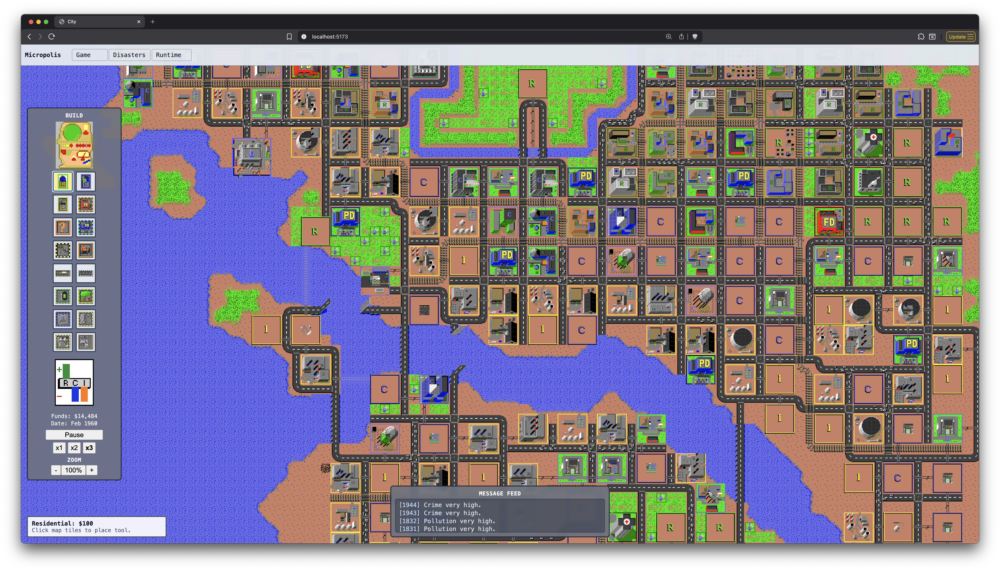

# Micropolis (TypeScript ported by gpt-5.3-codex)



The SimCity (1989) codebase was open sourced by EA under the name "Micropolis" as part of the OLPC (One Laptop Per Child) project. It's a C codebase, but large parts of it were ported from Assembly.

I wanted to push how long I can run the current generation of LLMs unattended if they are working with a clear spec and verifiable tasks, so I decided to port it to TypeScript and make it run in the browser.

I used exclusively `gpt-5.3-codex` with thinking set to high. After 4 days of work (most of it just letting Codex run unattended), this is what I ended up with.

My main innovation was creating a harness that calls the C code and uses `fast-check` to assert that my code behaves the same as the source for arbitray input.

Surprisingly this got a lot of attention on Twitter, including

- Garry Tan - https://x.com/garrytan/status/2021241956806922370
- Greg Brockman - https://x.com/gdb/status/2021272681237361027
- Sriram Krishnan - https://x.com/sriramk/status/2021268764923244550

So I decided to publish the codebase.

Originally my goal was to port the game and then make it multiplayer (humans and LLMs) as a fun/art project. I might still do that in the future, but I'll freeze this codebase as a reference. PRs likely won't be accepted.

## Requirements
- Node.js >= 24
- pnpm >= 10.28 (Corepack recommended)

## Getting started
```bash
corepack enable
pnpm install
pnpm dev
```

## Workspace layout
- `apps/web`: Vite + React app using TanStack Router (file-based routes live in `src/routes`)
- `packages`: Ports of the core Micropolis engine, tiles, harness, etc

## Common commands
```bash
pnpm dev
pnpm build
pnpm lint
pnpm typecheck
pnpm test
pnpm format
```

## Autonomous task orchestration
The repo includes a Codex-driven orchestrator at `scripts/auto-orchestrator.mjs`. I change it for each long-running task, so it just contains whatever made sense for the last iteration.

Inspect queue + drift:
```bash
pnpm auto:queue
pnpm auto:drift
```

Run unattended (default runtime cap: 24 hours):
```bash
pnpm auto:run -- --max-runtime-minutes 1440
```

Useful flags:
- `--once`: complete exactly one task and stop.
- `--dry-run`: plan/selection only; no git push or PR changes.
- `--streams <id,...>`: run only specific stage stream ids (`stage-0` ... `stage-4`).
- `--no-tests`: remove `pnpm test` from `--checks` if present.
- `--max-retries-per-task <n>`: retries before a task is marked blocked.
- `--model <name>`: pass a specific model to `codex exec`.

The orchestrator stores state/logs in `.automation/`.
Create `.automation/STOP` to halt the loop after the current iteration.

## Turborepo remote caching
Remote caching is ready to wire up when you want it:
```bash
pnpm dlx turbo login
pnpm dlx turbo link
```
Then set `TURBO_TOKEN` and `TURBO_TEAM` in CI secrets.

## License
This project is a modified version of the Micropolis source released by Electronic Arts under the GNU General Public License v3 (or later). The full GPLv3 text is in [LICENSE](LICENSE). The original Micropolis license notice and additional terms (including trademark restrictions) are preserved in [ref/micropolis/README](ref/micropolis/README).
